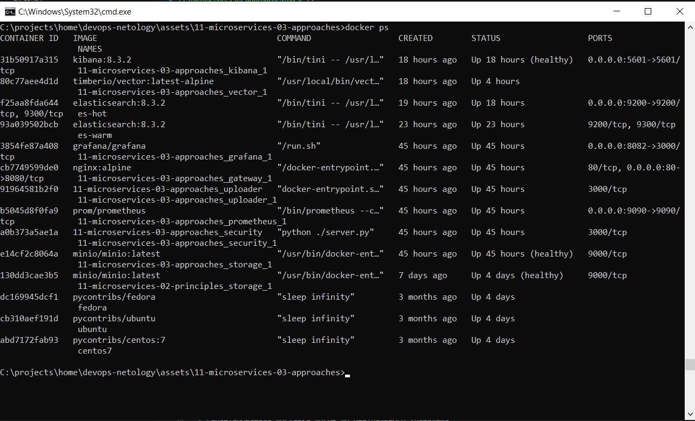
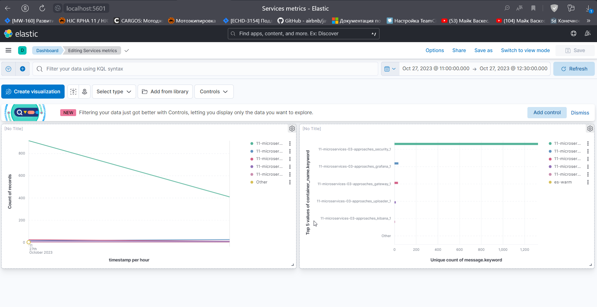
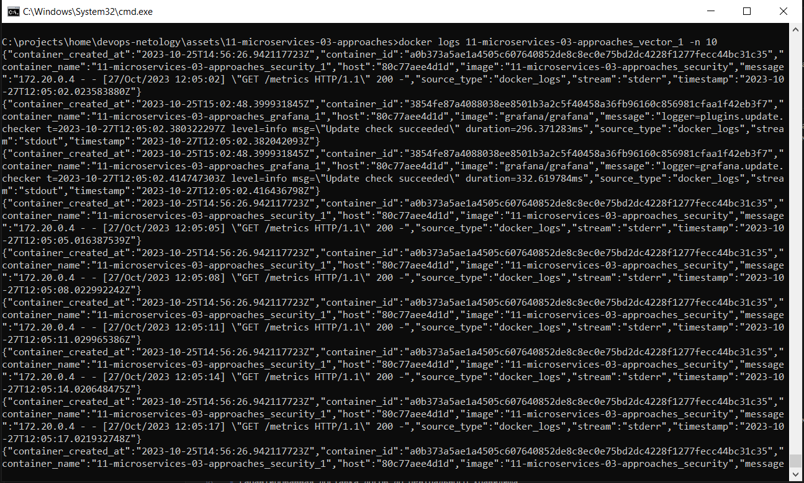
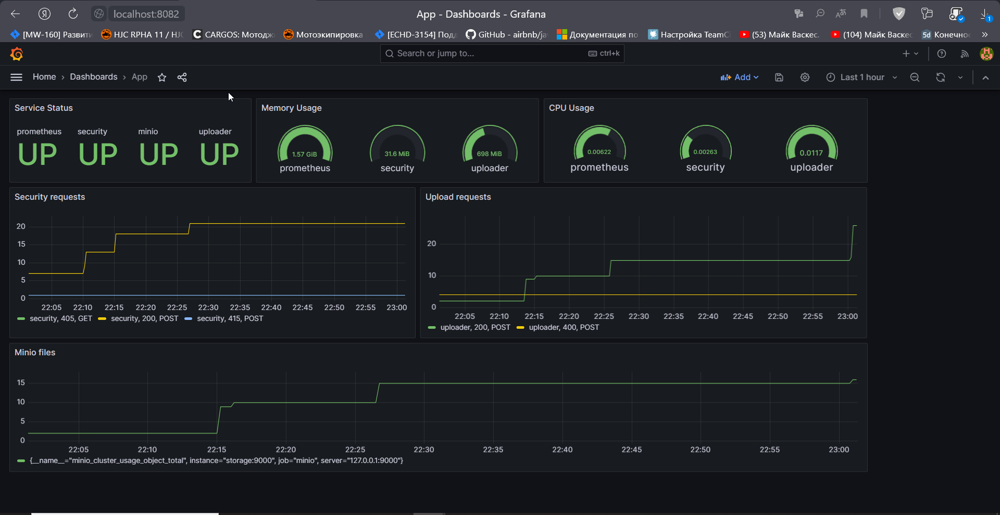

# Домашнее задание к занятию «Микросервисы: подходы»

Вы работаете в крупной компании, которая строит систему на основе микросервисной архитектуры.
Вам как DevOps-специалисту необходимо выдвинуть предложение по организации инфраструктуры для разработки и эксплуатации.

## Задача 1: Обеспечить разработку

Постановка задачи

Предложите решение для обеспечения процесса разработки: хранение исходного кода, непрерывная интеграция и непрерывная поставка. 
Решение может состоять из одного или нескольких программных продуктов и должно описывать способы и принципы их взаимодействия.

Решение должно соответствовать следующим требованиям:
- облачная система;
- система контроля версий Git;
- репозиторий на каждый сервис;
- запуск сборки по событию из системы контроля версий;
- запуск сборки по кнопке с указанием параметров;
- возможность привязать настройки к каждой сборке;
- возможность создания шаблонов для различных конфигураций сборок;
- возможность безопасного хранения секретных данных (пароли, ключи доступа);
- несколько конфигураций для сборки из одного репозитория;
- кастомные шаги при сборке;
- собственные докер-образы для сборки проектов;
- возможность развернуть агентов сборки на собственных серверах;
- возможность параллельного запуска нескольких сборок;
- возможность параллельного запуска тестов.

Обеспечение процесса CI/CD:  
1. Комплексное решение `Gitlab CI`  
   Данное решение поддерживает все заявленные требования и может использоваться как On-premise, так и SaaS-решение 
2. Отдельные продукты:
- Облачный провайдер (например `yandex.cloud`)
- Система контроля версий (например `Gitea`)
- Система CI/CD (например `Jenkins`, `DroneCI`)
- Хранилище артефактов (например `Nexus`)
- Хранилище секретов (например `Hashicorp Vault`)
- Хранилище файлов (например `minio S3`)

## Задача 2: Логи

Постановка задачи

Предложите решение для обеспечения сбора и анализа логов сервисов в микросервисной архитектуре.
Решение может состоять из одного или нескольких программных продуктов и должно описывать способы и принципы их взаимодействия.

Решение должно соответствовать следующим требованиям:
- сбор логов в центральное хранилище со всех хостов, обслуживающих систему;
- минимальные требования к приложениям, сбор логов из stdout;
- гарантированная доставка логов до центрального хранилища;
- обеспечение поиска и фильтрации по записям логов;
- обеспечение пользовательского интерфейса с возможностью предоставления доступа разработчикам для поиска по записям логов;
- возможность дать ссылку на сохранённый поиск по записям логов.

Для обеспечения сбора и анализа логов в микросервисах часто используют ELK (logstash + elastic + kibana) стек.   
#### По продуктам на каждом этапе:   
1. Хранение данных - `Elasticsearch`, `Clickhouse`
2. Сборщик логов / агент - `Vector`, `Filebeat`, `Fluentd` 
3. Поиск и отображение - `Grafana`, `Kibana`
4. Брокер очередей - `Kafka`, `RabbitMQ` 

## Задача 3: Мониторинг

Постановка задачи

Предложите решение для обеспечения сбора и анализа состояния хостов и сервисов в микросервисной архитектуре.
Решение может состоять из одного или нескольких программных продуктов и должно описывать способы и принципы их взаимодействия.  

Решение должно соответствовать следующим требованиям:
- сбор метрик со всех хостов, обслуживающих систему;
- сбор метрик состояния ресурсов хостов: CPU, RAM, HDD, Network;
- сбор метрик потребляемых ресурсов для каждого сервиса: CPU, RAM, HDD, Network;
- сбор метрик, специфичных для каждого сервиса;
- пользовательский интерфейс с возможностью делать запросы и агрегировать информацию;
- пользовательский интерфейс с возможностью настраивать различные панели для отслеживания состояния системы.

Для обеспечения сбора и анализа состояния хостов часто используют решения на базе `prometheus` со сборщиком метрик `node_exporter` и отображением в `grafana`. Как альтернатива в качестве хранения метрик может использоваться `victoria metrics`  
Так же данная функциональность будет доступна почти из коробки при использовании `Kubernetes` + `ArgoCD` или `Docker Swarm` + `Swarmpit`  

## Задача 4: Логи * (необязательная)

Продолжить работу по задаче API Gateway: сервисы, используемые в задаче, пишут логи в stdout. 

Добавить в систему сервисы для сбора логов Vector + ElasticSearch + Kibana со всех сервисов, обеспечивающих работу API.

#### Ссылка на [docker-compose.yaml](assets/11-microservices-03-approaches/docker-compose.yaml)  

## Задача 5: Мониторинг * (необязательная)

Продолжить работу по задаче API Gateway: сервисы, используемые в задаче, предоставляют набор метрик в формате prometheus:

- сервис security по адресу /metrics,
- сервис uploader по адресу /metrics,
- сервис storage (minio) по адресу /minio/v2/metrics/cluster.

Добавить в систему сервисы для сбора метрик (Prometheus и Grafana) со всех сервисов, обеспечивающих работу API.
Построить в Graphana dashboard, показывающий распределение запросов по сервисам.

#### Ссылка на [docker-compose.yaml](assets/11-microservices-03-approaches/docker-compose.yaml)  

