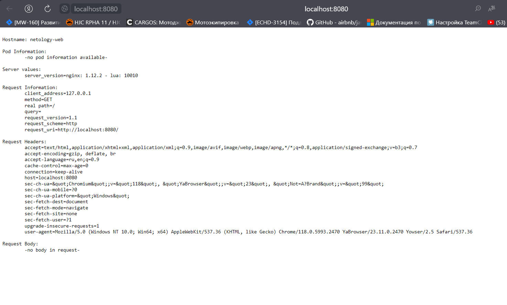

# Домашнее задание к занятию «Базовые объекты K8S»

### Инструменты и дополнительные материалы, которые пригодятся для выполнения задания

1. Описание [Pod](https://kubernetes.io/docs/concepts/workloads/pods/) и примеры манифестов.
2. Описание [Service](https://kubernetes.io/docs/concepts/services-networking/service/).

------

### Задание 1. Создать Pod с именем hello-world

1. Создать манифест (yaml-конфигурацию) Pod.
2. Использовать image - gcr.io/kubernetes-e2e-test-images/echoserver:2.2.
3. Подключиться локально к Pod с помощью `kubectl port-forward` и вывести значение (curl или в браузере).

[Ссылка на манифест](assets/12-kuber-02/echo-server.yaml)

```sh
qwuen@LAPTOP-2QLN04RI:/mnt/c/projects/home/devops-netology/assets/12-kuber-02$ ls
 echo-server.yaml  'pods and svc.puml'   port-forward-pod.puml
qwuen@LAPTOP-2QLN04RI:/mnt/c/projects/home/devops-netology/assets/12-kuber-02$ kubectl apply -f echo-server.yaml
pod/echoserver created
qwuen@LAPTOP-2QLN04RI:/mnt/c/projects/home/devops-netology/assets/12-kuber-02$ kubectl get pods
NAME         READY   STATUS    RESTARTS   AGE
echoserver   1/1     Running   0          25s
qwuen@LAPTOP-2QLN04RI:/mnt/c/projects/home/devops-netology/assets/12-kuber-02$ kubectl port-forward pods/echoserver 8080:8080
Forwarding from 127.0.0.1:8080 -> 8080
Forwarding from [::1]:8080 -> 8080
Handling connection for 8080
Handling connection for 8080
Handling connection for 8080
```

Проверка:  
```sh
qwuen@LAPTOP-2QLN04RI:/mnt/c/Users/v_sid$ curl localhost:8080


Hostname: echoserver

Pod Information:
        -no pod information available-

Server values:
        server_version=nginx: 1.12.2 - lua: 10010

Request Information:
        client_address=127.0.0.1
        method=GET
        real path=/
        query=
        request_version=1.1
        request_scheme=http
        request_uri=http://localhost:8080/

Request Headers:
        accept=*/*
        host=localhost:8080
        user-agent=curl/7.68.0

Request Body:
        -no body in request-
```

------

### Задание 2. Создать Service и подключить его к Pod

1. Создать Pod с именем netology-web.
2. Использовать image — gcr.io/kubernetes-e2e-test-images/echoserver:2.2.
3. Создать Service с именем netology-svc и подключить к netology-web.
4. Подключиться локально к Service с помощью `kubectl port-forward` и вывести значение (curl или в браузере).

[Ссылка на манифест](/assets/12-kuber-02/netology-web.yaml)

```sh
qwuen@LAPTOP-2QLN04RI:/mnt/c/projects/home/devops-netology/assets/12-kuber-02$ kubectl delete -f echo-server.yaml
pod "echoserver" deleted
qwuen@LAPTOP-2QLN04RI:/mnt/c/projects/home/devops-netology/assets/12-kuber-02$ ls
 echo-server.yaml   netology-web.yaml  'pods and svc.puml'   port-forward-pod.puml
qwuen@LAPTOP-2QLN04RI:/mnt/c/projects/home/devops-netology/assets/12-kuber-02$ kubectl get pods
No resources found in default namespace.
qwuen@LAPTOP-2QLN04RI:/mnt/c/projects/home/devops-netology/assets/12-kuber-02$ kubectl apply -f netology-web.yaml
pod/netology-web created
service/netology-svc created
qwuen@LAPTOP-2QLN04RI:/mnt/c/projects/home/devops-netology/assets/12-kuber-02$ kubectl port-forward service/netology-svc 8080:8080
Forwarding from 127.0.0.1:8080 -> 8080
Forwarding from [::1]:8080 -> 8080
Handling connection for 8080
```

