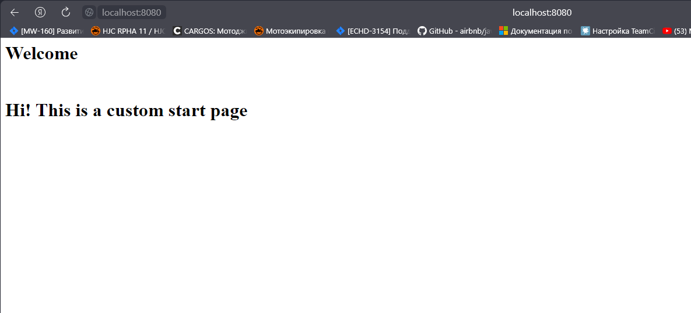
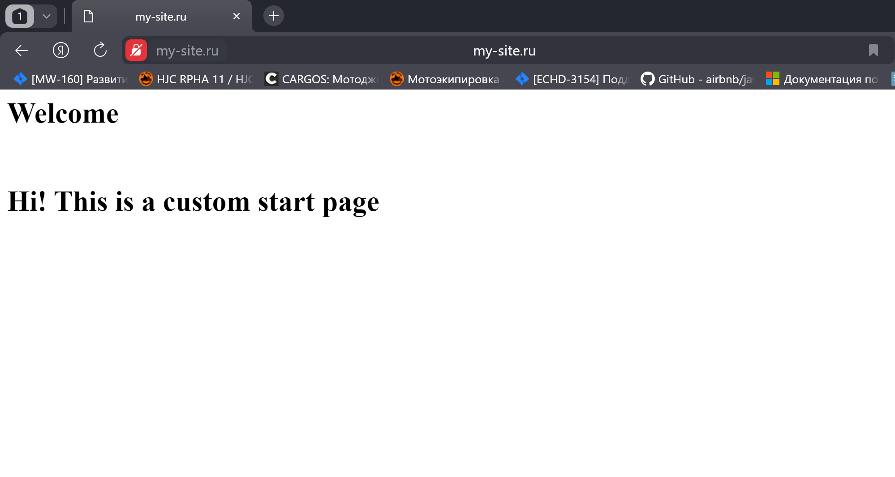

# Домашнее задание к занятию «Конфигурация приложений»


### Инструменты и дополнительные материалы, которые пригодятся для выполнения задания

1. [Описание](https://kubernetes.io/docs/concepts/configuration/secret/) Secret.
2. [Описание](https://kubernetes.io/docs/concepts/configuration/configmap/) ConfigMap.
3. [Описание](https://github.com/wbitt/Network-MultiTool) Multitool.

------

### Задание 1. Создать Deployment приложения и решить возникшую проблему с помощью ConfigMap. Добавить веб-страницу

1. Создать Deployment приложения, состоящего из контейнеров nginx и multitool.
```sh
qwuen@MSI:~$ kubectl create namespace my
namespace/my created
qwuen@MSI:/mnt/d/projects/devops-netology/assets/12-kuber-08/manifests$ ls
configmap.yml  deployment.yml
qwuen@MSI:/mnt/d/projects/devops-netology/assets/12-kuber-08/manifests$ kubectl apply -f deployment.yml -n my
deployment.apps/deployment created
qwuen@MSI:/mnt/d/projects/devops-netology/assets/12-kuber-08/manifests$ kubectl get po -n my
NAME                          READY   STATUS              RESTARTS   AGE
deployment-6bfb7c8784-wwgrn   0/2     ContainerCreating   0          15s
```
2. Решить возникшую проблему с помощью ConfigMap.
```sh 
qwuen@MSI:/mnt/d/projects/devops-netology/assets/12-kuber-08/manifests$ kubectl apply -f configmap.yml -n my
configmap/nginx-configmap created
qwuen@MSI:/mnt/d/projects/devops-netology/assets/12-kuber-08/manifests$ kubectl get po -n my
NAME                          READY   STATUS              RESTARTS   AGE
deployment-6bfb7c8784-wwgrn   0/2     ContainerCreating   0          87s
qwuen@MSI:/mnt/d/projects/devops-netology/assets/12-kuber-08/manifests$ kubectl get po -n my
NAME                          READY   STATUS    RESTARTS   AGE
deployment-6bfb7c8784-wwgrn   2/2     Running   0          3m19s
```
3. Продемонстрировать, что pod стартовал и оба конейнера работают.
4. Сделать простую веб-страницу и подключить её к Nginx с помощью ConfigMap. Подключить Service и показать вывод curl или в браузере.
```sh
qwuen@MSI:/mnt/d/projects/devops-netology/assets/12-kuber-08/manifests$ kubectl apply -f service-nginx.yml -n my
service/nginx-srv created
qwuen@MSI:/mnt/d/projects/devops-netology/assets/12-kuber-08/manifests$ kubectl get svc -n my
NAME        TYPE        CLUSTER-IP       EXTERNAL-IP   PORT(S)   AGE
nginx-srv   ClusterIP   10.152.183.142   <none>        80/TCP    2m1s
qwuen@MSI:/mnt/d/projects/devops-netology/assets/12-kuber-08/manifests$ kubectl port-forward svc/nginx-srv 8080:80 -n my
Forwarding from 127.0.0.1:8080 -> 80
Forwarding from [::1]:8080 -> 80
Handling connection for 8080
Handling connection for 8080
```


5. Предоставить манифесты, а также скриншоты или вывод необходимых команд.

Манифесты:
- [deployment.yml](/assets/12-kuber-08/manifests/deployment.yml)
- [configmap.yml](/assets/12-kuber-08/manifests/configmap.yml)
- [service-nginx.yml](/assets/12-kuber-08/manifests/service-nginx.yml)

------

### Задание 2. Создать приложение с вашей веб-страницей, доступной по HTTPS 

1. Создать Deployment приложения, состоящего из Nginx.
2. Создать собственную веб-страницу и подключить её как ConfigMap к приложению.
3. Выпустить самоподписной сертификат SSL. Создать Secret для использования сертификата.
```sh
qwuen@secure-pc:/mnt/d/projects/devops-netology/assets/12-kuber-08/manifests$ openssl req -x509 -days 365 -newkey rsa:2048 -sha256 -nodes -keyout nginx.key -out nginx.crt -subj "/CN=my-site.ru"
Generating a RSA private key
..................................................................................................................................................+++++
...................................................................................+++++
writing new private key to 'nginx.key'
-----
qwuen@secure-pc:/mnt/d/projects/devops-netology/assets/12-kuber-08/manifests$ kubectl create secret tls nginx-tls --cert=nginx.crt --key=nginx.key -n my
secret/nginx-tls created
qwuen@secure-pc:/mnt/d/projects/devops-netology/assets/12-kuber-08/manifests$ kubectl get secret -o yaml -n my
apiVersion: v1
items:
- apiVersion: v1
  data:
    tls.crt: LS0tLS1CRUdJTiBDRVJUSUZJQ0FURS0tLS0tCk1JSURDekNDQWZPZ0F3SUJBZ0lVQSttWE1kb3hJTFBJenBwdjFmT3MvblRCdEw4d0RRWUpLb1pJaHZjTkFRRUwKQlFBd0ZURVRNQkVHQTFVRUF3d0tiWGt0YzJsMFpTNXlkVEFlRncweU5EQXhNakl4TkRJd05EVmFGdzB5TlRBeApNakV4TkRJd05EVmFNQlV4RXpBUkJnTlZCQU1NQ20xNUxYTnBkR1V1Y25Vd2dnRWlNQTBHQ1NxR1NJYjNEUUVCCkFRVUFBNElCRHdBd2dnRUtBb0lCQVFDdi9pK0J4Wk8yTGZMWHBKRXdMcmdOQ1BvTWFJMTJRRXlteVgza2Q2VTcKVHJITnVFbGs5dXMvQlozazF0QTBqUmhVWTZmR2VlVjNrNjR2aG03a1V3SVhHaHlDc2lXd0JRN3RKNHBMY1h0UgpTY25XVG1Sb2ZVSi9SY1VHM3U4NUloNzYrc2lsN3BrN0syaUpFR1lMZk1aVnptaTFGdHJUUVJ2emVYaFNzNjVUCkpMbEhBVm1UeVovYWZzMGNqODJzUVBRZ0h6U0RYUHNJTStDNEVyRkpIS1NIeGRHcGprODJNRjMxdlVhcisvR3QKNzluaUpnaWlNZ0twMWZ2ZWdERUFmdkhqTU1Sd3V2cW9lSUc3UjNlcDVmdnp3aUU3ZWtSTzZScXRHcTZCekUrQgpyejJPdEhPeEhxWmtYbHIrRm1DckNnMkZIV2luRzRwSFp5dnkrd3FvbHNRUkFnTUJBQUdqVXpCUk1CMEdBMVVkCkRnUVdCQlJSaXBTUmhoUG45clZzOFFOZW93K01LQ3FJdGpBZkJnTlZIU01FR0RBV2dCUlJpcFNSaGhQbjlyVnMKOFFOZW93K01LQ3FJdGpBUEJnTlZIUk1CQWY4RUJUQURBUUgvTUEwR0NTcUdTSWIzRFFFQkN3VUFBNElCQVFCQQptL0ZqcTdnYjY5STJMOGkvV2NSajUxWWhJSm1xU0c2ZW8vNFFOeWoxK2lSaTRBbHNkc0ZQeEFObEVScHRLbU5SCk1TYWZKQ0hWYkpxcnRyWWlEdEN5c2Z0MCtxeUo3a3llMWVXQUNsbnQ4SkZBSjRLQUJwWU1XUm5GMVBGK1lyenEKc3dIYjU0VGlYTXJ6TnFWQWVXRnVrTGxMSkZjQzBXVk1VT3ZLYjZLeFZTTzF1eGZoblEwbDY1SFl3Q1YyeHliZQoxa1F2WEIxVkh4c1daRUNDb2ZidFlpSWN0dXBJdC9kZzl6STFDb2p1bmtMVEtyTGhuK1RuNUtLblVVV0tlTUtHCjB1SjY0Q01lYmNydHp4Vkk3cjAxMFJUN2tUWjR1bWZLTzJINW9vN3FwdlVYaGNUZDZYTWlhOHd2Mm0rYzJYTnQKYmVvSkRMTGlkS0dlTWlPWXJHSVkKLS0tLS1FTkQgQ0VSVElGSUNBVEUtLS0tLQo=
    tls.key: LS0tLS1CRUdJTiBQUklWQVRFIEtFWS0tLS0tCk1JSUV2QUlCQURBTkJna3Foa2lHOXcwQkFRRUZBQVNDQktZd2dnU2lBZ0VBQW9JQkFRQ3YvaStCeFpPMkxmTFgKcEpFd0xyZ05DUG9NYUkxMlFFeW15WDNrZDZVN1RySE51RWxrOXVzL0JaM2sxdEEwalJoVVk2ZkdlZVYzazY0dgpobTdrVXdJWEdoeUNzaVd3QlE3dEo0cExjWHRSU2NuV1RtUm9mVUovUmNVRzN1ODVJaDc2K3NpbDdwazdLMmlKCkVHWUxmTVpWem1pMUZ0clRRUnZ6ZVhoU3M2NVRKTGxIQVZtVHlaL2FmczBjajgyc1FQUWdIelNEWFBzSU0rQzQKRXJGSkhLU0h4ZEdwams4Mk1GMzF2VWFyKy9HdDc5bmlKZ2lpTWdLcDFmdmVnREVBZnZIak1NUnd1dnFvZUlHNwpSM2VwNWZ2endpRTdla1JPNlJxdEdxNkJ6RStCcnoyT3RIT3hIcVprWGxyK0ZtQ3JDZzJGSFdpbkc0cEhaeXZ5Cit3cW9sc1FSQWdNQkFBRUNnZ0VBREhhQ3BMejZIZCtaSDk0K2pkdnhHck0xQ2VYcGhxTTlDbDZnZEtwb1lBL04KbFpUa1Zhc0tzN2JSSEtCOXRBcjkyeFFIa0kyWFMyV0E0MHF3MWFodk1IV2Y2VDEyWDhXcjdlMXI1TFhQbHMwVAo1d0k4S0E0ZXhHYUxjbFlkT0wySzFoa21WbUhVSmhXSDNKVDF0UUNNQncyTDZxOElwZ2NwVkkrWWpycThzSlIrCkdFSTYrbkd5WDV0Q2NRb3dkQTlISGNWVkJRY3RZTWNiTmpNaTlBS2MzUFBwRUdFdXVZSkJuWkdYUjc5cjEwb1MKUzh3eHVwd0tLb2RCNTZTSjBFeUxLMWRVUjgxcHpCQXlhcXVjeXovN3lTN3NoN2U0Z0pJVWFjb0lDY0taUjRtbAorRUl1MHIzaTM5MFVPMUtrTVdJZ1orZkJpeG82RytaN1hNTmsvVDNwUVFLQmdRRGMySS9PT0FRcGFjMzM4RTlBCm1sRWZocW1nSUhVY2NhS3NEbndKQzZ1YnFyVnZiRlptSTY2R2QvcWVjbEFwZzVxaWpUQ1UzRWZuK0p1NFJRdVYKQTQyZDcyZFEzMTVwWFZKRjA5MlpRZXBFRFl1RnlMT0dBWm5Sb3hHOGJtaEVqTExLSTFJTmJTNnZEOC9ScFh5awp3RjFqRkFrdit6dUtXa2VseW53T0txRGl1UUtCZ1FETUFkNmppV2d5UHJ4TnJwM3BIb2M4aE9velZ0Q1J3SVNFCjlaU2JtYU9EZEVXQW5kaVdXVGxhbmhLMEVPeUNCR01qczdLUmtoT0t6V1FwZzVabHhqUW9HeVRma0pzeVpDTXMKZDJHRGtIdStkRVNHQXJ0Q0FsNmU3bTRlbWc3REw0UHp5SHltd0krZk1wU1pVZ3NkbXNqUExVY2NHeVY5aFE3TAp3ZHNRR0JXZ0dRS0JnQ2Rjemh6aWJSTjRrVWFNNVlOTlBnSlJmVEJXT0tsdU02RlpINUI1TFFnYzRDUFErb0ZRCkFNNWsyaDJkb0Y0VjM5enpMMktJOUtRSzhxNWdXQlVpUWY2UmFpZkcrRXZ0WHptazdvMWZhMExmNnl0WVAyODIKSDlWMnJEV2F0Q2pycnY1S1YxaWZTai9Yb0tIc1RoQUxYVm5JZTI2NjU3emNKSU1QV1JjcFQrMjVBb0dBVVZVdApmZVY2TlEzdDVNcUpDamV4a3Q4cXYrME1tZzgyeGd0aWcrWnMyaXV3eWVZa1EweXZJUUdFVTJXcjVPbjYzSEQzCjhERmN1U25KbFFOeElvSXlxUXFwV0xnK0o0amt2UVdiU3VoL2JSN05jdUFENS8wcDNCTVN0QUNYZ2htZmNjR3MKY0k2MHM3Tm1xdm1hbE9Md3pDZ3hBWE9STHNtdGJHNk05NDJpa1lFQ2dZQms1MU5pVXNFQythb3lnYVJFZDNHbwovd3IwL3lFTkZyN1pBK01SOXpKcUZkbFh6eVdTaS9saHFTS1c2MUFvYTdSeTVxVWxIS0lJUFlJczBJNElicnBZClhJSHdJQ3B3dVVoNnY2TzVJajFoM2tybWdMZGgxNGR0TE00eGNydkJxTDNPb0kxZEwxUUdaTTRycHo1dFBVYUYKUnVFWUVKUGNjZEtTWHZYTW5HUnkxZz09Ci0tLS0tRU5EIFBSSVZBVEUgS0VZLS0tLS0K
  kind: Secret
  metadata:
    creationTimestamp: "2024-01-22T14:22:19Z"
    name: nginx-tls
    namespace: my
    resourceVersion: "6268"
    uid: 2a62d362-9d5d-444a-9d69-d0acc1551ed6
  type: kubernetes.io/tls
kind: List
metadata:
  resourceVersion: ""
```

```sh
# localhost name resolution is handled within DNS itself.
#	127.0.0.1       localhost
#	::1             localhost
192.168.56.10       my-site.ru
```
4. Создать Ingress и необходимый Service, подключить к нему SSL в вид. Продемонстировать доступ к приложению по HTTPS. 
4. Предоставить манифесты, а также скриншоты или вывод необходимых команд.

```sh
qwuen@secure-pc:/mnt/d/projects/devops-netology/assets/12-kuber-08/manifests$ kubectl create ns my
namespace/my created
qwuen@secure-pc:/mnt/d/projects/devops-netology/assets/12-kuber-08/manifests$ ls
configmap.yml         deployment.yml  nginx.crt  nginx-secret.yml
deployment-nginx.yml  ingress.yml     nginx.key  service-nginx.yml
qwuen@secure-pc:/mnt/d/projects/devops-netology/assets/12-kuber-08/manifests$ kubectl apply -f deployment-nginx.yml -n my
deployment.apps/deployment-nginx created
service/nginx-svc created
qwuen@secure-pc:/mnt/d/projects/devops-netology/assets/12-kuber-08/manifests$ kubectl apply -f ingress.yml -n my
ingress.networking.k8s.io/nginx-ingress created
qwuen@secure-pc:/mnt/d/projects/devops-netology/assets/12-kuber-08/manifests$ kubectl apply -f nginx-secret.yml -n my
secret/nginx-tls created
qwuen@secure-pc:/mnt/d/projects/devops-netology/assets/12-kuber-08/manifests$ kubectl get all -n my
NAME                                    READY   STATUS              RESTARTS   AGE
pod/deployment-nginx-645d546f8b-qv4gg   0/1     ContainerCreating   0          3m28s

NAME                TYPE        CLUSTER-IP       EXTERNAL-IP   PORT(S)   AGE
service/nginx-svc   ClusterIP   10.152.183.182   <none>        443/TCP   3m28s

NAME                               READY   UP-TO-DATE   AVAILABLE   AGE
deployment.apps/deployment-nginx   0/1     1            0           3m28s

NAME                                          DESIRED   CURRENT   READY   AGE
replicaset.apps/deployment-nginx-645d546f8b   1         1         0       3m28s
```



Манифесты:
- [deployment-nginx.yml](/assets/12-kuber-08/manifests/deployment-nginx.yml)
- [ingress.yml](/assets/12-kuber-08/manifests/ingress.yml)
- [nginx-secret.yml](/assets/12-kuber-08/manifests/nginx-secret.yml)
- [configmap.yml](/assets/12-kuber-08/manifests/configmap.yml)
------